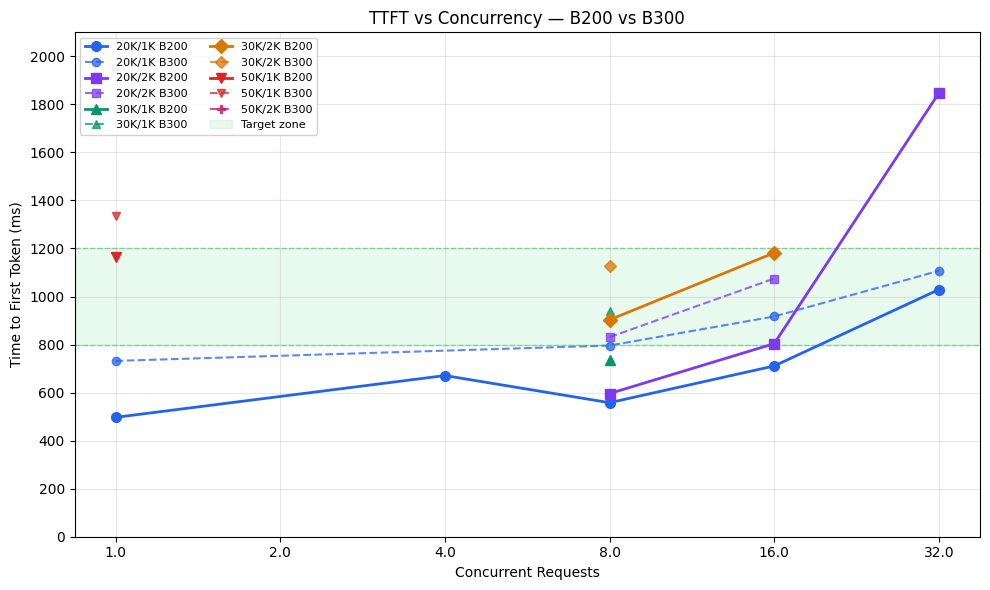
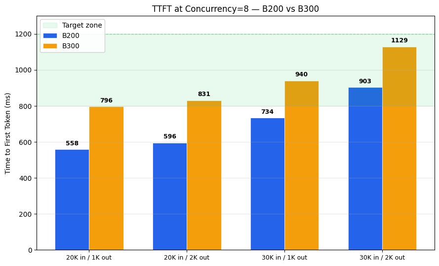
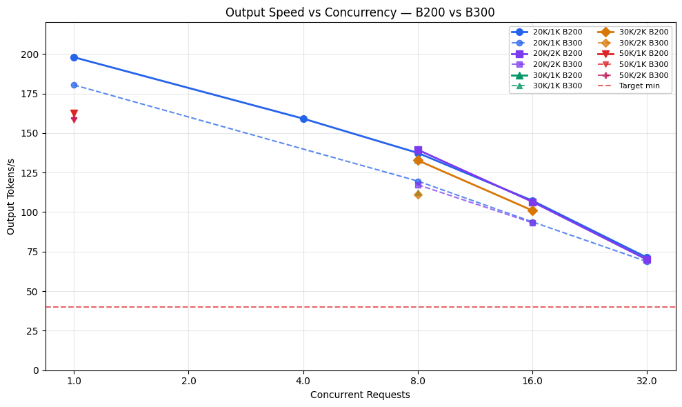
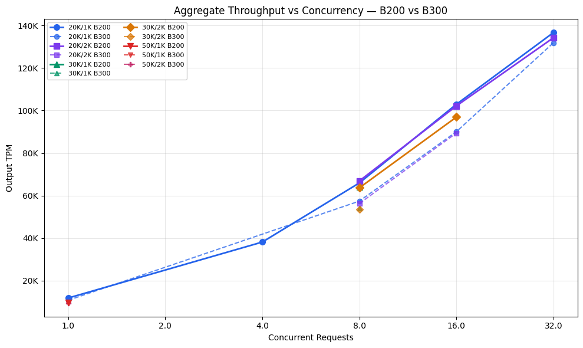

| | |
|---|---|
| **Hardware** | 16× NVIDIA B200 and 16× NVIDIA B300 GPUs, each in disaggregated prefill/decode configuration (8 prefill + 8 decode) |
| **Model** | Kimi K2.5 |
| **Workload** | Coding agent — 20K–50K input tokens with ~20K shared system prompt (97% prefix cache hit rate), 1–2K output tokens |

---

## Customer Targets

| Metric | Target |
|---|---|
| Time to First Token (TTFT) | 0.8–1.2 s |
| Output tokens/s (per request) | 35–40 tok/s |
| Average QPS | 5 |
| Scale | 1M TPM |

---

## Benchmark Results

### B200 Results (16×B200 disagg 8+8)

| Input Tokens | Output Tokens | Concurrency | TTFT (ms) | Output tok/s | Output TPM | Status |
|:---:|:---:|:---:|---:|---:|---:|:---:|
| 20K | 1K | 1 | 497 | 197.9 | 11,872 | **PASS** |
| 20K | 1K | 4 | 671 | 159.1 | 38,179 | **PASS** |
| 20K | 1K | 8 | 558 | 137.4 | 65,972 | **PASS** |
| 20K | 1K | 16 | 711 | 107.2 | 102,955 | **PASS** |
| 20K | 1K | 32 | 1,029 | 71.2 | 136,648 | **PASS** |
| 20K | 2K | 8 | 596 | 139.4 | 66,909 | **PASS** |
| 20K | 2K | 16 | 804 | 106.5 | 102,194 | **PASS** |
| 20K | 2K | 32 | 1,847 | 69.9 | 134,228 | **FAIL** |
| 30K | 1K | 8 | 734 | 133.4 | 64,036 | **PASS** |
| 30K | 2K | 8 | 903 | 132.7 | 63,675 | **PASS** |
| 30K | 2K | 16 | 1,182 | 101.0 | 96,929 | **PASS** |
| 50K | 1K | 1 | 1,165 | 162.5 | 9,748 | BORDERLINE |

### B300 Results (16×B300 disagg 8+8)

| Input Tokens | Output Tokens | Concurrency | TTFT (ms) | Output tok/s | Output TPM | Status |
|:---:|:---:|:---:|---:|---:|---:|:---:|
| 20K | 1K | 1 | 732 | 180.4 | 10,821 | **PASS** |
| 20K | 1K | 8 | 796 | 119.6 | 57,421 | **PASS** |
| 20K | 1K | 16 | 917 | 93.8 | 90,070 | **PASS** |
| 20K | 1K | 32 | 1,107 | 68.7 | 131,866 | **PASS** |
| 20K | 2K | 8 | 831 | 117.3 | 56,301 | **PASS** |
| 20K | 2K | 16 | 1,075 | 93.2 | 89,433 | **PASS** |
| 30K | 1K | 8 | 940 | 112.5 | 54,015 | **PASS** |
| 30K | 2K | 8 | 1,129 | 111.3 | 53,446 | **PASS** |
| 50K | 1K | 1 | 1,336 | 158.3 | 9,500 | **FAIL** |
| 50K | 2K | 1 | 1,948 | 159.3 | 9,558 | **FAIL** |

---

## Key Findings

1. **Output speed comfortably exceeds target on both GPUs.** Even at c=32 the lowest observed output speed is 68.7 tok/s (B300) — nearly 2× the 35–40 tok/s target. Output speed is not a bottleneck.

2. **TTFT is the binding constraint.** At the target workload profile (20K–30K input, 97% cache):
   - c ≤ 16: TTFT stays within the 0.8–1.2s target window on B200
   - c = 32 with 2K output: TTFT rises to 1.85s on B200 (FAIL)
   - B300 runs tighter against the 1.2s limit at lower concurrency levels

3. **B200 has better TTFT than B300 across the board.** At c=8 (the sweet spot), B200 is 30–40% faster on TTFT: 558ms vs 796ms (20K/1K), 596ms vs 831ms (20K/2K), 734ms vs 940ms (30K/1K). B200 is the better fit for this TTFT-sensitive workload.

4. **Sweet spot is concurrency 4–8 on B200.** At these levels the deployment delivers:
   - TTFT: 500–900 ms (comfortably under 1.2s)
   - Output speed: 110–160 tok/s (3–4× target)
   - Per-replica throughput: ~64K–66K output TPM

5. **Scaling to QPS=5:** At c=8 each B200 replica sustains ~1 QPS, so approximately **5 replicas (80 B200 GPUs)** are needed to reach the QPS=5 target.

---

## Charts

### TTFT vs. Concurrency (B200 vs B300)

### TTFT at Concurrency=8 (B200 vs B300)

### Output Speed vs. Concurrency (B200 vs B300)

### Aggregate Throughput vs. Concurrency (B200 vs B300)

---

## Caveats

- Benchmarks use synthetic prompts with simulated prefix cache hits. Real coding-agent traffic will differ in cache patterns, input length distribution, burst behavior, and speculative decoding effectiveness.
- Results are per-replica (1 replica = 16 GPUs in disagg 8+8 configuration).

---

## Recommended Next Steps

1. Provision a **B200** disagg 8+8 deployment on the customer account (`baidu`) with 1 replica for live traffic testing.
2. Scale replicas based on target QPS (~1 replica per QPS at c=8).
3. Monitor real-world TTFT and output speed against synthetic benchmarks.
