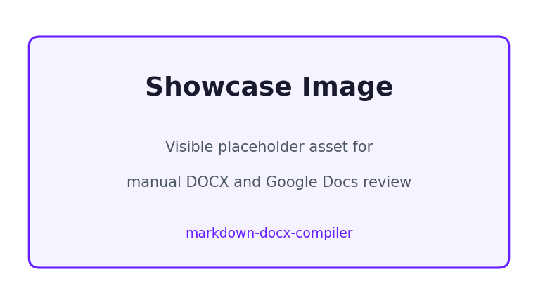

# 人工复核示例文档

这是一段中文引导段落，用来检查导入 Google Docs 之后首段的版式和字体是否仍然清晰可读。

## 关键结果

<!-- docx:id=zh-results-table -->
| 指标 | 数值 | 状态 |
| :--- | ---: | :---: |
| TTFT | 734 | 通过 |
| 输出速度 | 133.4 | 通过 |
| 吞吐量 | 64,036 | 通过 |

## 说明

- 第一条说明
- 第二条说明，包含 **加粗** 和 *斜体*

> 这条引用用于验证提示性文本的视觉差异。

```sql
SELECT deployment_id, avg_ttft_ms
FROM benchmark_results
ORDER BY avg_ttft_ms ASC;
```



This mixed paragraph keeps English and 中文 together for bilingual layout verification.
